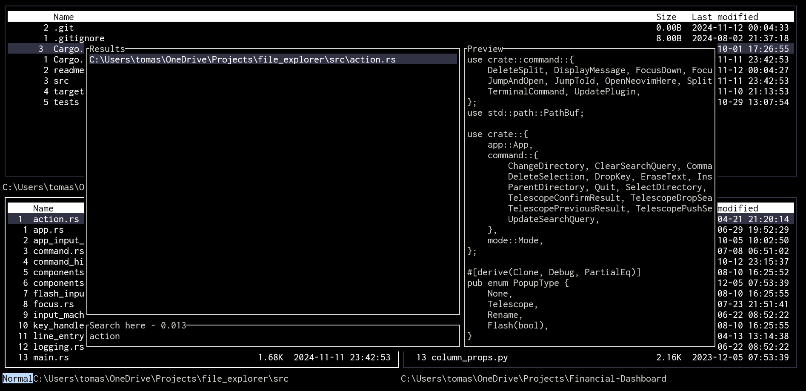

A neovim-inspired, non-async file explorer, written purely in Rust.
Currently under development and unstable.

# App Mappings

## Normal mode

| Mappings      | Action                                                                                          |
| ------------- | ----------------------------------------------------------------------------------------------- |
| `j`           | Next item                                                                                       |
| `k`           | Previous item                                                                                   |
| `<Backspace>` | Move to parent directory                                                                        |
| `<Enter>`     | Open selected item                                                                              |
| `<C-o>`       | Go back in directory history                                                                    |
| `<C-i>`       | Go forward in directory history                                                                 |
| `dd`          | Delete selected item                                                                            |
| `r`           | Rename selected item                                                                            |
| `u`           | Undo last action (delete/rename)                                                                |
| `<C-r>`       | Redo last action (delete/rename)                                                                |
| `n`           | Next search result                                                                              |
| `N`           | Previous search result                                                                          |
| `<C-w>v`      | Split vertically                                                                                |
| `<C-w>s`      | Split horizontally                                                                              |
| `<C-h>`       | Move to left split                                                                              |
| `<C-j>`       | Move to lower split                                                                             |
| `<C-k>`       | Move to upper split                                                                             |
| `<C-l>`       | Move to right split                                                                             |
| `\`           | Enter search mode                                                                               |
| `:`           | Enter command mode                                                                              |
| `<space>sg`   | Search files by name (similar to [telescope](https://github.com/nvim-telescope/telescope.nvim)) |
| `<space>on`   | Open neovim in current directory (comes back to the app after closing neovim)                   |
| `m`           | Jump to item (similar to [flash](https://github.com/folke/flash.nvim))                          |
| `M`           | Jump to item and open it (see above)                                                            |

### Git integration

| Mappings    | Action                                          |
| ----------- | ----------------------------------------------- |
| `<space>hc` | Git add and commit (waits to enter the message) |
| `<space>ht` | Show git status                                 |
| `<space>hP` | Push current branch to remote                   |
| `<space>hO` | Pull current branch from remote                 |

## Telescope

| Mappings  | Action             |
| --------- | ------------------ |
| `<C-n>`   | Next item          |
| `<C-p>`   | Previous item      |
| `<Enter>` | Open selected item |

# Commands

The only built-in command is the quit command, `q`, which closes the app.
One can use the terminal commands, such as `git status`, similar to neovim, by pre-pending them with an exclamation mark: `!git status`, when in command mode.

# To-do

- [ ] File manipulation abilities
  - [x] Delete
  - [ ] Cut
  - [ ] Copy
  - [ ] Paste
  - [ ] Enable motions of all of the above (see Keymap system)
  - [ ] Delete backup files upon leaving the app
- [ ] Dir navigation
  - [x] Go up and down the history of a single ExplorerTable
  - [ ] Show directory history of the currenct ExplorerTable
  - [ ] Show currently open directories and jump to one of them
- [ ] Tooling
  - [ ] Show diffs between files in the same directory
- [ ] Git integration
  - [x] Show tracked/untracked/staged/unstaged/modified files
  - [ ] Implement shortcuts for commiting/pushing/checking out individual/ groups of files
  - [ ] Preview file changes with a shortcut
- [ ] Plugin management
  - [ ] Manage the non-core features through the Plugin trait
  - [ ] Allow attaching certain plugins upon launching the app
- [ ] Keymap system
  - [ ] Enable motions/multipliers for commands (e.g. 3dd)
  - [ ] Allow managing/adding keymaps through an accessible interface (lua script/toml file)
  - [x] Allow assigning keymaps to terminal commands
  - [ ] Allow searching for keymaps through Telescope
- [ ] Terminal commands
  - [ ] Allow autocompletion of commands
  - [ ] Show history of commands
